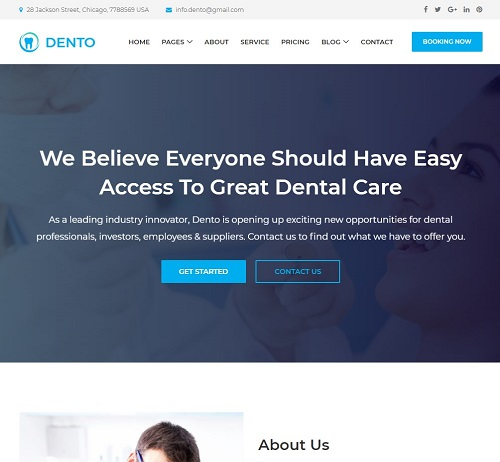

# Dental Website
A Django-based website for a fictional dental practice.

## About
This website was built as part of a course by John Elder on his [Codemy](https://codemy.com/) platform, which focuses on integrating static HTML templates into a Django project to create dynamic, real-world websites. Other key takeaways from this project include sending email via Python, and deploying a Django project to Heroku for live hosting.

This project uses the Dento template by [ColorLib](https://colorlib.com/)